::: {style="text-align: right;"}
 
:::

For the YouTube livestream schedule, see [here](https://www.youtube.com/@cytometryinr)

For screen-shot slides, click [here](/course/03_InsideFCSFile/slides.qmd)

 

---

# Background

During weeks twelve through fourteen of the [Cytometry in R course](), we primarily focus on how to work with raw Spectral Flow Cytometry (SFC) .fcs files. During Week 12, we learn how to extract out and characterize fluorescent signatures that are present in our unmixing controls (both single-color and unstained). This is followed up on Week 13 by learning how to compare these signatures to each other, allowing us to predict how they will interact in context of a SFC panel. Finally, in Week 14, we take the fluorescent signatures we have derived from our unmixing controls and use them to unmix full-stained samples. 

Due to the nature of the course, the datasets used in the above examples were downsampled to streamline the processs. However, a lot can be learned working with the complete datasets. This walk-through therefore contains the steps needed to retrieve and process the original .fcs files as retrieved from the [ImmPort](https://www.immport.org/) repository. 

ImmPort (Immunology Database and Analysis Portal) is a open access platform for research data sharing, primarily intended as a repository for datasets generated as part of [NIH](https://www.nih.gov/) and [NIAID](https://www.niaid.nih.gov/) funded grants. It includes many different types of immunological data, including  conventional, spectral and mass cytometry datasets. 

We are slated to cover how to retrieve data programmatically from ImmPort via the API [later in the course](https://umgcccfcsr.github.io/CytometryInR/Schedule.html#databases-and-repositories), however, in the meanwhile, this walk-through will cover how to assess and download individual datasets via the website. This can be a little bit of challenge for the un-initiated, so we will depict our typical workflow of one of the many ways that these datasets can be accessed and downloaded. 

# Walk Through

## Accessing ImmPort

Let's start by first navigating to the [ImmPort repository](https://www.immport.org/). The landing page at the time of writing this walk-through is shown below. 

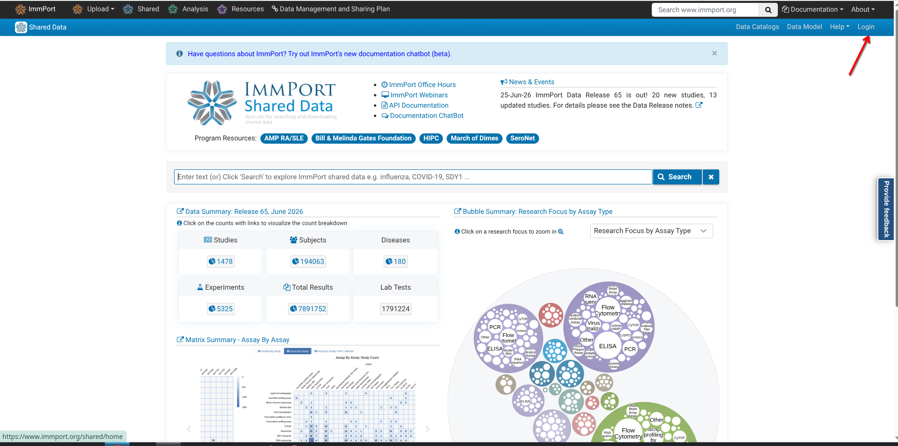

If this is your first time using the ImmPort repository, you will need to create a free account. The simplest way to start the process is to go ahead and click on the [login button](https://www.immport.org/auth/login) on the upper-right hand of the screen. 

This will take you to the login page, which also includes the the option to register for an ImmPort account. Go ahead and select the option to register. 

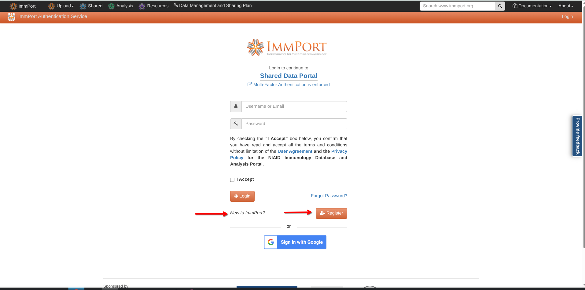

You will then reach a page giving you notice about the next steps and about accepting ImmPort's terms of use before being able to access the datasets. Select Continue. 

After which point, you will reach a page with the various fields needed to proceed with your account registration. 

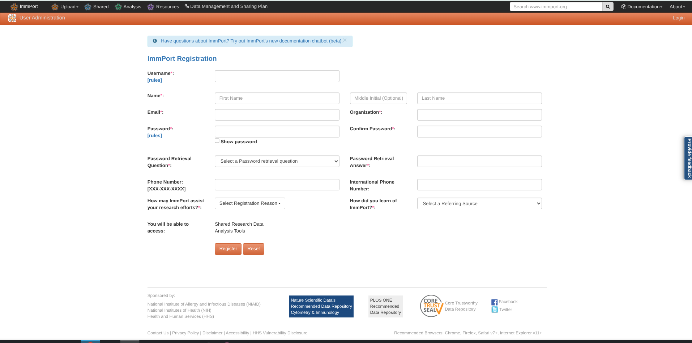

You will next be taken through a couple steps, at which point your account will be registered and approved. Proceed back to the login screen.  

 

After providing your login information, you will be prompted to go through two-factor authentication steps. First retrieve the code sent to your email addresss

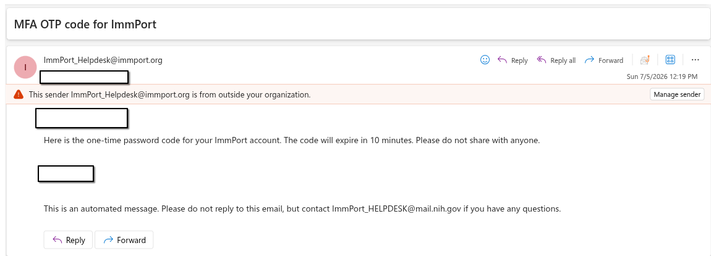

And then proceed to provide it to the two-factor authentication screen. 

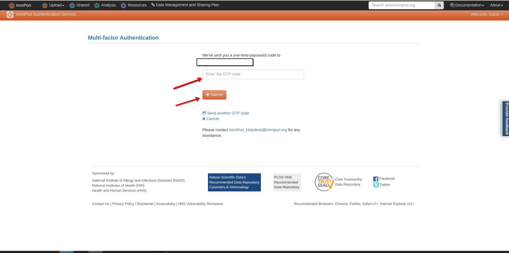

Congratulations, you have now both registered and logged in to ImmPort, you are now able to access the datasets. 

## Downloading Datasets

Once logged in, start off by looking up the [SDY3080](https://www.immport.org/shared/search?text=SDY3080) dataset. 

The [SDY3080](https://www.immport.org/shared/search?text=SDY3080), which is the SFC dataset associated with our [Rach et al. 2025](https://www.frontiersin.org/journals/immunology/articles/10.3389/fimmu.2025.1628145/full) *Frontiers in Immunology* paper looking at Cord Blood Innate-Like T cell responses in neonates born to healthy women and women living with HIV. The full-stained cord blood samples were stimulated for intracellular cytokines with PMA-ionomycin, and then stained with a 29-fluorophore spectral flow cytometry panel. It is one of the few spectral flow cytometry datasets currently on ImmPort to also include the raw (not-yet-unmixed) data. 

Go ahead and select the study accession number to proceed to the study specific page. 

From there, under Download options, select the Study Package (Web) option. 

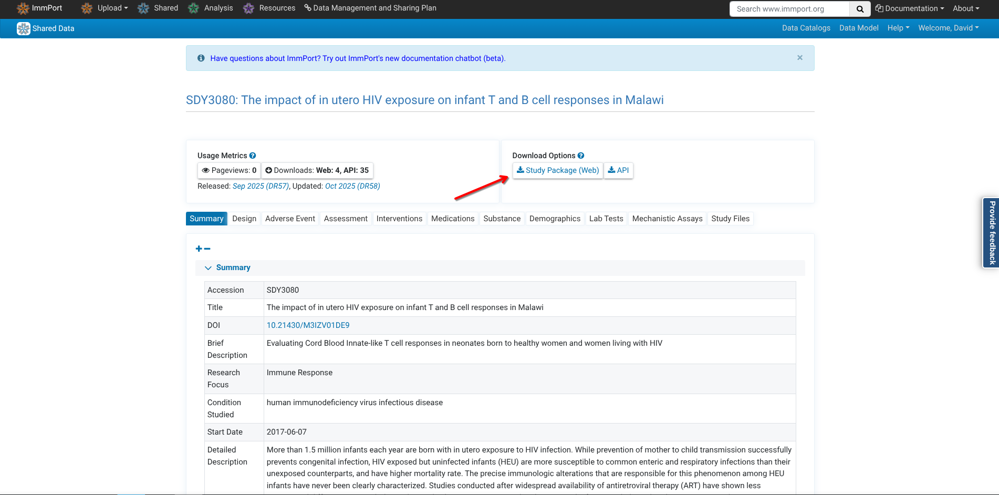

Proceed into the Results Folder

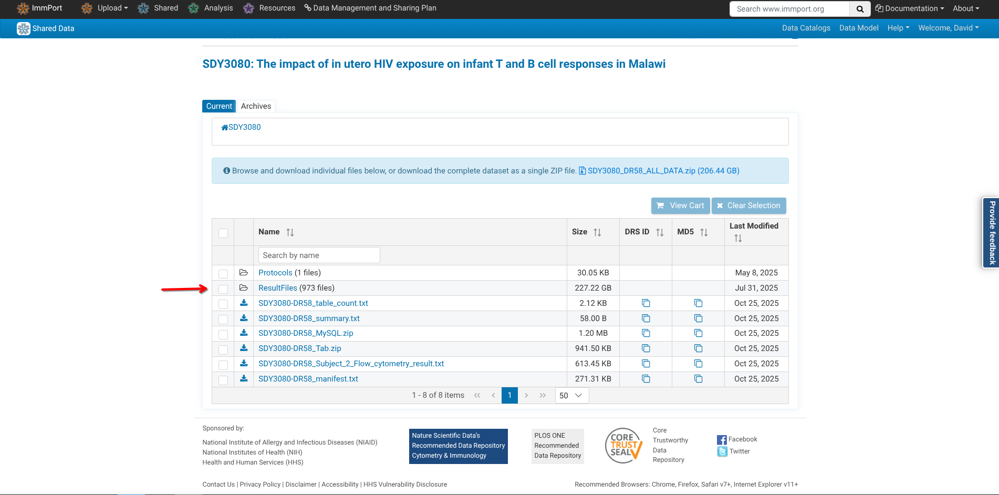

Proceed into the Flow Cytometry Results sub folder

Change the number of displayed files to maxinum

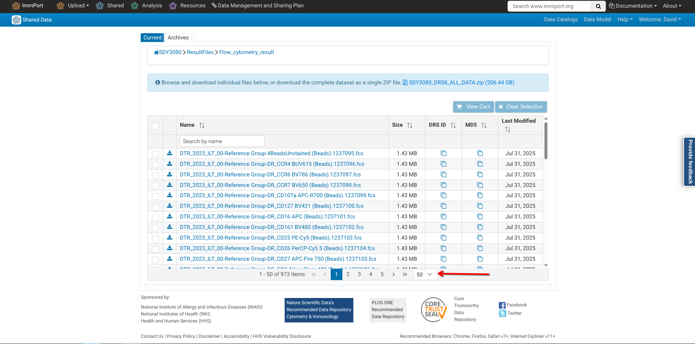

Proceed to select the files of interest. The ILT_00 was a collection of bead single-color controls acquired before the experimental series start. The first experiment is denoted by ILT_01, and consist of the single color reference controls, specimen specific by condition unstained samples, and then the full-stained samples (Ctrl, Ctrl Tetramer, PMA)

Proceed to the Download Cart option

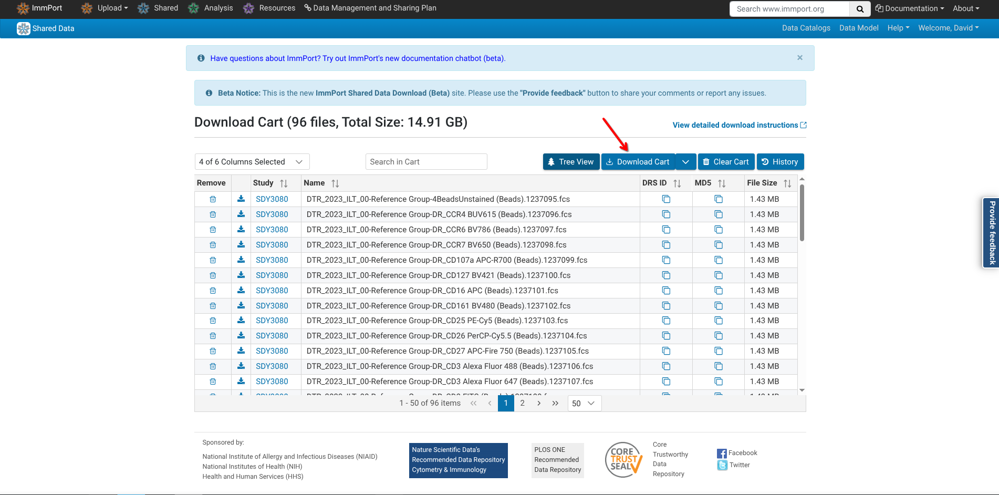

Agree to the Download

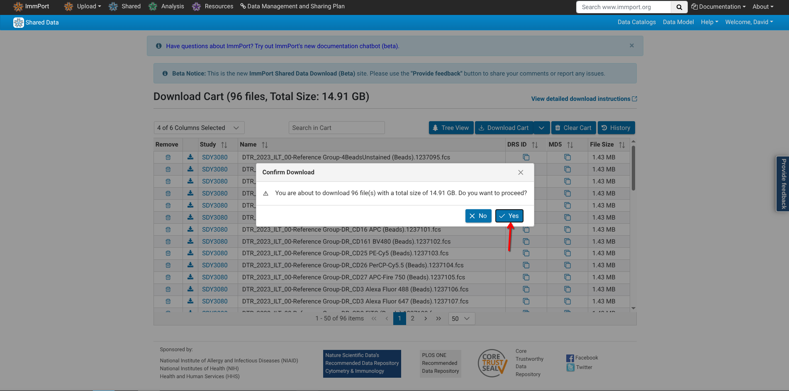

Wait for the download to begin

If successful, save the folder to your desired location. Then proceed to extract the contents

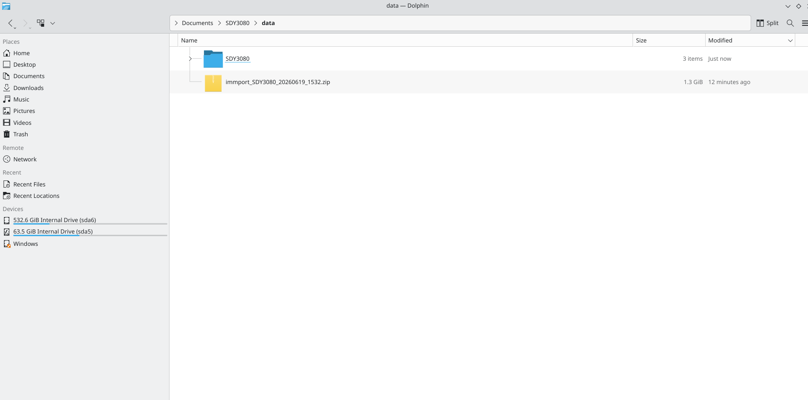

For our walk-through, we are choosing to organize the extracted out files directly under the following folders

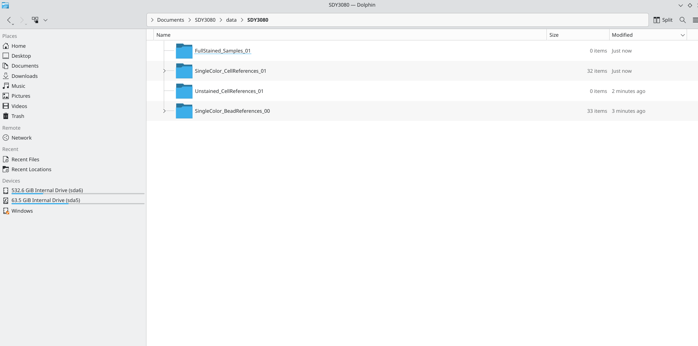

And here is an example of the original file sizes

And an example of the original file sizes for the bead controls. 

As we expect for raw .fcs files with > 3 million events, the .fcs files are rather large

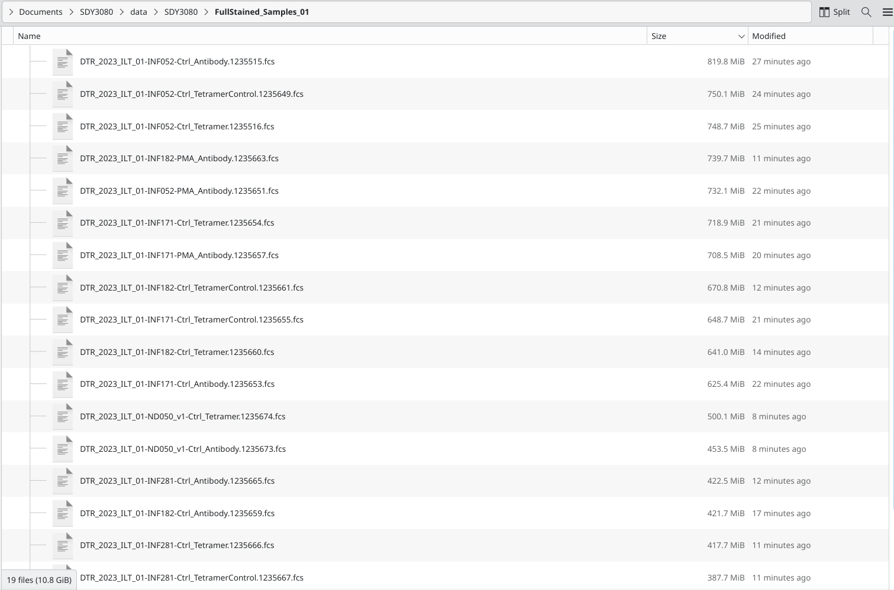

And for this dataset, there are specimen-matched unstaineds for both stimulation conditions

Occasionally, when downloading via web, ImmPort will fail out on the attempt (see error message below). You can still click individually on the download arrow next to each file to download individually if this occurs

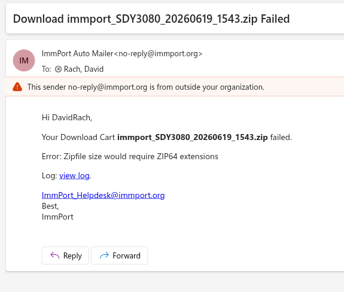

Vs. if the combined files are under 1 GB, they don't require the extension, and download proceeds normally. 

There are additional ways to download via the API which are outside of todays scope. 

# Discussion

Example

# Additional Resources

[Example]()